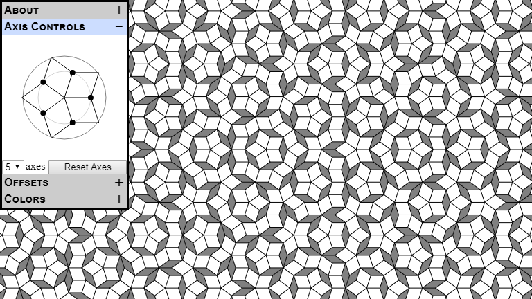

# Cut-and-Project Tiling

This applet is an interactive demonstration of cut-and-project tiling.

Cut-and-project tilings are made by a 2-dimensional plane cutting through a higher dimensional square lattice. Lattice points in the neighborhood of the cutting plane are projected onto the plane and connected by edges to create the tiling. The well-known Penrose tiling is among the many tilings that can be generated this way.

[Try it on github.io!](https://gglouser.github.io/cut-and-project-tiling/)

[Explanation of controls](docs/intro.md) and how it works.

Check out a small [gallery of examples](docs/gallery.md).

## Requirements

This applet is (currently) plain old ES6 JavaScript. It requires HTML canvas support.

## Acknowledgments

The axis control rosette appeared in an old screenshot I once saw of a cut-and-project tiling generator that ran on NeXTSTEP. Never saw the code, but I borrowed the idea. (Before that, I was trying to control the orientation of the cutting plane with angles.)
